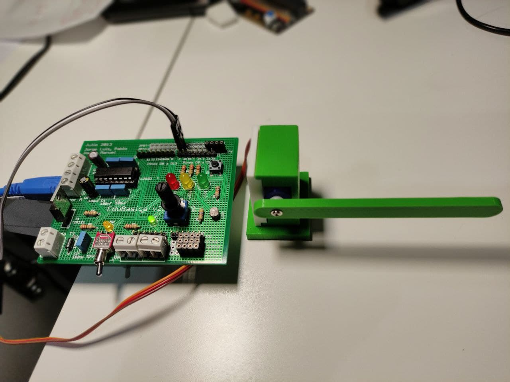

# Taller de Edubásica con Arduinoblocks

|   	|   	|   	|
||	|	|

## Enlaces

* [Sitio de Edubasica](http://www.practicasconarduino.com/)
* [Sitio de Arduinoblocks](http://www.arduinoblocks.com/web/)

## Proyectos compartidos

* [Potenciómetro y microservo](http://www.arduinoblocks.com/web/project/486532)
* [LDR y microservo](http://www.arduinoblocks.com/web/project/483939)
* [Juego de reflejos](http://www.arduinoblocks.com/web/project/486592)
* [Caja y barrera para microservo](https://github.com/pedroruizf/diseno_3d/tree/master/disenos/microservo)

